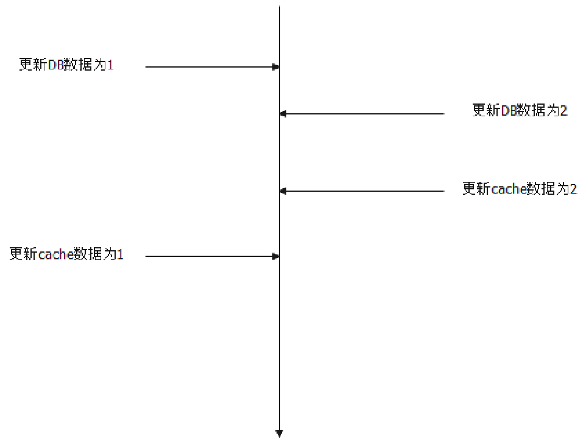
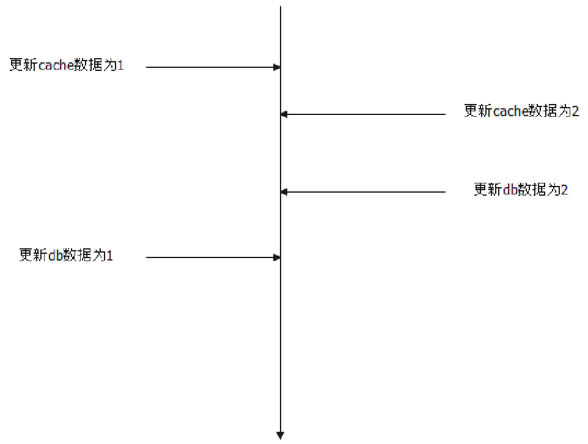
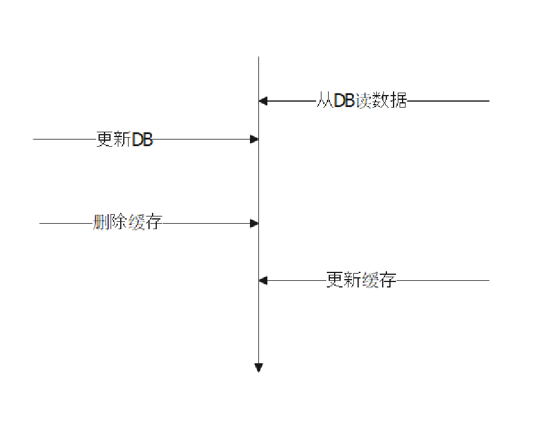

# 缓存

解析：缓存的面试其实分成两大块：
- 缓存的基本理论
- 缓存中间件的应用

这里我们讨论缓存的一些基本理论，缓存中间件 Redis 等，在对应的中间件章节里面看里面查看。

缓存的基本理论，目前来说考察比较多的是：
- 缓存和 DB 一致性的问题
- 缓存模式
- 缓存穿透、缓存击穿、缓存雪崩

### 缓存和 DB 一致性问题

为了方便讨论，这里就将问题简化为 DB 和缓存一致性。也就是更新只需要更新 DB 和缓存。

首先要记住，缓存一致性的问题根源于两个原因：
- 不同线程并发更新 DB 和数据库；
- 即便是同一个线程，更新 DB 和更新缓存是两个操作，容易出现一个成功一个失败的情况；

缓存和 DB 一致性的问题可以说是无最优解的。无论选择哪个方案，总是会有一些缺点。

最常用的是三种必然会引起不一致的方案，这三种方案大同小异。面试的时候要记住为什么它们会引起不一致。这三种方案都是有一个显著特征，就是如果缓存是会过期的，那么它们最终都会一致。

1. 先更新 DB，再更新缓存。不一致的情况：
   1. A 更新 DB，DB中数据被更新为1
   2. B 更新 DB，DB中数据被更新为2
   3. B 更新缓存，缓存中数据被更新为2
   4. A 更新缓存，缓存中数据被更新为1
   5. 此时缓存中数据为1，而DB中数据为2。这种不一致会一直持续到缓存过期，或者缓存和DB再次被更新，并且被修改正确；

1. 先更新缓存，再更新 DB。不一致的情况；
   1. A 更新缓存，缓存中数据被更新为1
   2. B 更新缓存，缓存中数据被更新为2
   3. B 更新 DB，DB中数据被更新为2
   4. A 更新 DB，DB中数据被更新为1
   5. 此时缓存中数据为2，但是DB 中数据为1。这种不一致会一直持续到缓存过期，或者缓存和DB再次被更新，并且被修改正确；

1. 先更新 DB，再删除缓存。不一致的情况；
   1. A 从数据库中读取数据1
   2. B 更新数据库为2
   3. B 删除缓存
   4. A 更新缓存为1
   5. 此时缓存中数据为1，数据库中数据为2

所以本质上，没有完美的解决方案，或者说仅仅考虑这种更新顺序，是不足以解决缓存一致性问题的。

与这三个类似的一个方案是利用 CDC 接口，异步更新缓存。但是本质上，也是要忍受一段时间的不一致性。比如说典型的，应用只更新 MySQL，然后监听 MySQL 的 binlog，更新缓存。

而如果需求强一致性的话，那么比较好的方案就是：
- 第一个是负载均衡算法结合 singleflight
- 第二个是分布式锁。严格来说，分布式锁的方案，我一点都不喜欢，毫无技术含量

第一个方案，稍微有点奇诡。我们可以考虑对 key 采用哈希一致性算法来作为负载均衡算法，那么我们可以确保，同一个 key 的请求，永远会落到同一台实例上。然后结合单机 singleflight，那么可以确保永远只有一个线程更新缓存或者 DB，自然就不存在一致性问题了。

这个方案要注意的是在哈希一致性算法因为扩容，或者缩容，或者重新部署，导致 key 迁移到别的机器上的时候，会出现问题。假设请求1、2都操作同一个 key：
- 请求1被路由到机器 C 上
- 扩容，加入了 C1 节点
- 请求2被路由到了 C1 节点上
- （以先写DB为例）请求1更新DB
- 请求2更新DB，请求2更新缓存
- 请求1更新缓存

在这种情况下，你不管怎么搞都会出现不一致的问题。那么可能的解决方案就是：
- 要么在部署 C1 之前，在 C 上禁用缓存
- 要么在部署 C1 之后，先不使用缓存，在等待一段时间之后，确保 C 上的迁移key的请求都被处理完了，C1 再启用缓存

分布式锁的方案就没什么好说的了，咔嚓一把分布式锁一了百了。分布式锁适用于写请求特别少的例子，因为读是没有必要加分布式锁的。读完全没有必要加分布式锁，即便此时有人正在更新缓存或者 DB，当前的请求要么读到更新前的，要么读到更新后的，不会有什么问题。

注意我说的写，是写缓存的写。也就是说，如果要是缓存过期，然后用 DB 的数据更新缓存，同样要参与抢夺这个分布式锁。

另外，一个可行的分布式锁方案的优化是在单机上引入 singleflight，确保一个实例针对一个特定的 key 只会有一个线程去参与抢全局的分布式锁。

注意！前面的这些方案，我们都有一个基本的假设，就是更新 DB 和更新缓存两个步骤都会成功。但是很显然这个假设是站不住脚的，也就是说，真正寻求强一致性，还要进一步解决更新 DB 和更新缓存一个成功一个失败的问题。

这里，也就是只有三个选项：
- 追求强一致性，选用分布式事务；
- 追求最终一致性，可以引入重试机制；
- 如果可以使用本地事务，那么应该是：开启本地事务-更新DB-更新缓存-提交事务

然后一个问题是：我用了分布式事务，我还需要分布式锁吗？答案是，要的。因为分布式事务既解决不了多个线程同时更新的问题，也解决不了一个线程更新，一个线程从数据库读数据刷缓存的问题。

### 缓存模式

缓存模式主要是所谓的 cache-aside, read-through, write-through, write-back, refresh ahead 以及更新缓存使用到的 singleflight 模式。这些模式并不是银弹，如果说某个模式优于其它的模式，这就是在扯淡了。因此，选择何种缓存模式，也就是一个业务层面上考虑的问题，大多数时候，选取任何一种模式都不会有问题。

- write-back：这个稍微有点意思。因为标准的 write-back 是在缓存过期的时候，然后再将缓存刷新到 DB 里面。因此，它的弊端就是，在缓存刷新到 DB 之前，如果缓存宕机了，比如说 Redis 集群崩溃了，那么数据就永久丢失了；但是好处就在于，因为过期才把数据刷新到 DB 里面，因为读写都操作的是缓存。如果缓存是 Redis 这种集中式的，那么意味着大家读写的都是同一份数据，也就没有一致性的问题。但是，如果你设置了过期时间，那么缓存过期之后重新从数据库里面加载的同时，又有一个线程更新缓存，那么两者就会冲突，出现不一致的问题；
- refresh ahead 这种其实就是前面说的利用 CDC 的方案

### 缓存异常场景

缓存穿透、击穿和雪崩，本质上就是一个问题：缓存没起效果。只不过根据不起效的原因进行了进一步的细分。

我一直觉得这三个东西的命名特别沙雕，因为穿透和击穿在中文语境下区别就不大，也不知道是哪个卧龙凤雏搞出来的名字。

其实，这三个就是描述了三种场景：
- 你数据库本来就没数据
- 你数据库有，但是缓存里面没有
- 你缓存本来有，但是突然一大批缓存集体过期了

数据库本来就没数据，所以请求来的时候，肯定是查询数据库的。但是因为数据库里面没有数据，所以不会刷新回去，也就是说，缓存里面会一直没有。因此，如果有一些黑客，一直发一些请求，这些请求都无法命中缓存，那么数据库就会崩溃。

如果数据库有，但是缓存里面没有。理论上来说，只要有人请求数据，就会刷新到缓存里面。问题就在于，如果突然来了一百万个请求，一百万个线程都尝试从数据库捞数据，然后刷新到缓存，那么数据库也会崩溃。

缓存本来都有，但是过期了。一般情况下都不会有问题，但是如果突然之间几百万个 key 都过期了，那么接下来的请求也几乎全部命中数据库，也会导致数据库崩溃。

## 面试题

### 如何解决缓存和 DB 的一致性问题
分析：日经题，每次面，但凡简历上出现了缓存两个字眼，就会问。甚至于，只要面试官公司用了缓存，他们就会问。

缓存和 DB 数据一致性的问题，先说结论：没有完美的方案，无非就是取舍问题。

一般的思路就是，先指出，先更新 DB 还是先更新缓存，还是更新DB之后删除缓存的方案，本质上都有一致性的问题，从而强调，仅仅依靠缓存和DB是做不到一致性的，要结合别的组件。

然后回答两个方案：
- 分布式锁方案：该方案亮点在于强调可以引入单机 singleflight 来减少锁竞争；
- 结合负载均衡算法，可以利用哈希一致性负载均衡算法和单机上的 singleflight

两个方案的本质都是确保只有一个线程操作特定的 key

答：缓存和 DB 的一致性问题，没有什么特别好的解决方案，主要就是一个取舍的问题。

如果能够忍受短时间的不一致，那么可以考虑只更新 DB，等缓存自然过期。大多数场景其实没有那么强的一致性需求，这样做就够了。

进一步也可以考虑先更新 DB 再更新缓存，或者先更新缓存再更新 DB，或者更新 DB 之后删除缓存，都会有不一致的可能，但是至少不会比只更新 DB 更差。

另外一种思路是利用 CDC 接口，比如说监听 MySQL 的binlog，然后更新缓存。应用是只更新 MySQL，丝毫不关心缓存更新的问题。（引导面试官问 CDC 问题，或者 MySQL binlog，或者说这种模式和别的思路比起来有什么优缺点）

至于说其它的比如说 cache-aside, write-through, read-through, write-back 也对一致性问题，毫无帮助。（引导面试官问之后几个 pattern）

如果追求强一致性，那么可行的方案有两个：
- 利用分布式锁。在读上没必要加锁，在写的时候加锁。（面试官可能会进一步问，为什么读不需要加锁，很简单，在同一个时刻，有人更新数据，有人读数据，那么读的人，读到哪个数据都是可以的。如果写已经完成，那么读到的肯定是新数据，如果写没有完成，读到的肯定是老数据）。（刷亮点）一种可行的优化方案，是在单机上引入 singleflight。那么更新某个 key 的时候，同一个实例上的线程自己竞争一下，决出一个线程去参与抢全局分布式锁。在写频繁的时候，这种优化能够有些减轻分布式锁的压力。（实际上，写频繁的还要追求强一致性，还要用缓存简直无力吐槽）
- 另外一个方案是利用负载均衡算法和 singleflight。可以选择一种负载均衡算法，即一个 key 只会被路由到同一个实例上。比如说使用一致性哈希算法。结合 singleflight，那么可以确保全局只有一个线程去更新数据，那么自然就不存在一致性的问题了。（开始进一步讨论这种方案的细节，也可以等面试官问。面试官要是水平高，他自然就会意识到在扩容缩容，或者重启的时候，会有问题。要是面试官水平不高，他是意识不到的，哈哈哈，所以可以用来试探一下面试官的斤两）
   
   这种方案的问题在于，在扩容、缩容、或者重启的时候，因为会引起 key 迁移到别的实例上，所以可能出现不一致的问题。在这种情况下，可以考虑两种方案。第一种方案是扩容或者缩容的时候在原本实例上禁用这些迁移 key 的缓存；另外一种方案是目标实例先不开启读这些迁移 key 的缓存，等一小段时间，确保原本实例上的这些迁移 key 的请求都被处理完了，然后再开启缓存。

#### 类似问题
- 在使用了缓存的时候，你先更新缓存还是先更新 DB
- 要是先更新缓存成功，再更新 DB 失败会怎样
- 要是先更新DB成功，但是更新缓存失败会怎样
- 更新 DB 之后，删除缓存的做法有什么弊端？怎么解决这种弊端？
  
### singleflight 是什么
分析：本质上来说，singleflight 只是一个设计模式，你可以用于缓存，也可以用于别的方面。
singleflight 是指，如果多个线程（协程）去做同一件事，那么我们可以采用 singleflight 模式，从多个线程里面挑出来一个去做，其余的线程就停下来等结果。

singleflight 在缓存里面主要用在更新缓存上，防止在缓存未命中的时候，多个线程同时访问 DB，给 DB 造成巨大的压力。

答：singleflight 是一种设计模式，使用这种设计模式，可以在我们更新缓存的时候，控制住只有一个线程去更新缓存。

不过，这里面强调的一个线程只是指同一个 key 只会有一个线程。因为我们并不会说更新不同的 key 也共享一个更新线程。

（亮点，要解释 singleflight 只在单机层面上，而不是在全局上）另外一个是，在分布式环境下，我们只做单机层面上的控制。也就是说，如果有多台机器，我们会保证一个机器只有一个线程去更新特定一个 key 的缓存。比如说，针对 key1，如果有三台机器，那么最多会有三个线程去更新缓存。

不做全局的原因很简单，在分布式环境下，数据库至少要能撑住这种多台机器同时发起请求的负载。而做全局的 singleflight 本质上就是利用分布式锁，这个东西非常消耗性能。

（如果是 Go 语言）在 Go 上，标准库直接提供了 singleflight 的支持。（这里要防面试官让你手写一个）

#### 类似问题
- 为什么用 singleflight
- 为什么 singleflight 只在单机层面上应用
- 如果要在全局层面上应用 singleflight，怎么搞？其实就是加一个分布式锁，没什么花头
