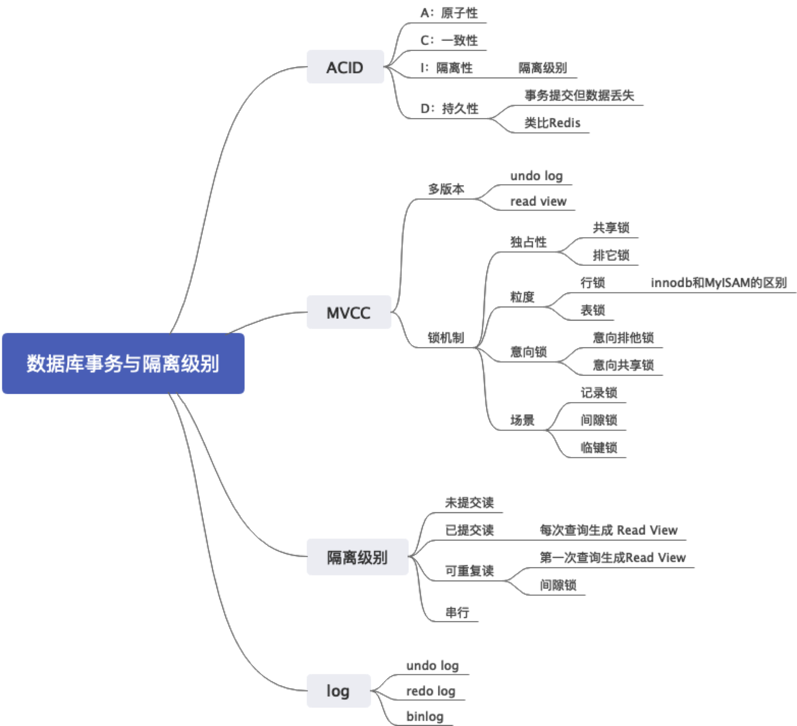

# 数据库事务

事务是指多个数据库操作组成一个逻辑执行单元，满足 ACID 四个条件。

A是指原子性，即这些操作要么全部成功，要么全部不成功，不存在中间状态；
C是指一致性，数据库从一个状态转移到另外一个状态，数据完整性约束不变。在分布式语境下，这个很多时候是指数据如果存储了多份，那么每一份都应该是一样的。（后面分布式语境，要小心一点，因为这一步，可能会让面试官准备考察分布式事务）
I是指隔离性，一个事务的执行不会影响另外一个事务；
D是指持久性，已提交对数据库的修改，应该永久保留在数据库中。（装逼点）而实际上MySQL的事务，如果设置不当，可能出现事务已经提交，但是并没有被持久化。（这一点是为了加分的，你需要记住后面的《事务提交了但是数据没有保存》）

在MySQL上，innodb引擎支持事务，但是MyISAM不支持事务。（这个是为了引导面试官问两个引擎的区别）

innodb 引擎是通过MVCC来支持事务的。（到这一步，停下来，接下来，面试官极大概率问你什么是MVCC）

关键点：ACID，innodb 通过 MVCC 支持事务

## 扩展点

### 什么是 MVCC

分析：MVCC算是一个常考的点，而且是一个能考察得很细很深入的点，这里我们尽量将话题控制在一个难度适中的地步。当然，如果你是DBA，那么你应该一路往下探讨直到源码层。这个问题问得非常的大，所以我们只需要回答要点就可以。而后，面试官如果想继续了解你的水平，他就会根据他感兴趣的要点问下去。这里的难点就是，要点太多……要背很多。

答案：MVCC，多版本并发控制。`innodb`引擎主要是通过`undo log` 和事务版本号来实现多版本，利用锁机制来实现并发控制。

（接下来仔细解释`undo log`和版本号的运作机制，其中`undo log`是为了引导面试官继续问相关的问题，如`redo log`，`bin log`。）

`innodb`引擎会给每张表加一个隐含的列，存储的是事务版本号。当修改数据的时候，会生成一条对应的`undo log`，`undo log`一般用于事务回滚，里面含有版本信息。简单来说可以认为`undo log`存储了历史版本数据。每当发起查询的时候，`MySQL` 依据隔离级别的设置生成`Read View`，来判断当前查询可以读取哪个版本的数据。例如，在已提交读的隔离级别下，可以从`undo log`中读取到已经提交的最新数据，而不会读取到当前正在修改尚未提交的事务的数据。

而锁机制，对于 innodb 来说，有多个维度：
1. 从独占性来说，有排他锁和共享锁；
2. 从锁粒度来说，有行锁和表锁；
3. 从意向来说，有排他意向锁和共享意向锁；
4. 从场景来说，还可以分为记录锁，间隙锁和临键锁；

分析：到这里停下来，上面这一番回答，基本上什么都点到了，接下来就是等提问了。这一堆回答，涉及到了很多知识点，可以考察的非常多：
1. `undo log`, `redo log`, `binlog`
2. 隔离级别
3. 各种锁，其中又以记录锁、间隙锁和临键锁比较有亮点
4. Read View

关键点：多版本 = redo log + 事务版本号，并发控制=各种锁

#### 如何引导
1. 讨论数据库事务隔离级别

### 能够解释一下MySQL的隔离级别吗？

分析：考察基本的知识点。如果只是背出来各种隔离级别和对应存在的问题，那么就达标了。刷亮点如何刷呢？一个是结合 MVCC 来阐述MySQL是如何支持的；一个是讨论 snapshot isolation。前者比较中规中矩，后者比较多是秀知识面。我们分成这两个思路，前面都类似，就是总结各种隔离级别。

数据库的隔离级别有四种：
1. 未提交读：事务可以读取另外一个事务没有提交的数据。            问题：脏读，不可重复读，幻读
2. 提交读：事务只能读取到另外一个已经提交的事务数据。            问题：     不可重复度，幻读
3. 重复读：事务执行过程查询结果都是一致的，innodb 默认级别。     问题：               幻读
4. 串行化：读写都会相互阻塞                                  问题：

MVCC 方向：
innodb 引擎利用了 `Read View` 来支持提交读和重复读。`Read View`里面维护这三个变量：
1. up_limit_id：已提交事务ID + 1
2. low_limit_id：最大事务ID + 1
3. txn_ids：当前执行的事务ID

提交读这个级别，默认读取是不加锁的，只有修改才会加锁。简单来说，已提交读，是每次查询都生成一个新的`Read View`，所以永远都能看到已经提交的事务。

可重复读则是在第一次查询生成`Read View`之后，后面的查询都是使用这个`Read View`。

snapshot isolation 方向：

innodb 引擎的可重复读隔离级别，要比定义的隔离级别更加严苛一点。一般的可重复读，无法解决幻读的问题。比如说原本你事务里面查询订单信息，这个时候又插入了一个新的订单，那么这种时候，幻读就会导致我们下一个查询就会查询到这条记录。但是 innodb 引擎的隔离级别并不会出现这个问题。

因为 innodb 引擎使用了临键锁，在“当前读”，也就是写的时候，锁住了记录之间的空档，防止插入数据。（这里面，不需要解释临键锁，等面试官提问）

#### 如何引导
1. 前面聊到了MVCC提到隔离级别，机会合适就可以主动发起进攻

### 什么是共享锁，排它锁

分析：概念题，答完顺便回答意向排他锁，意向共享锁，刷一波

答案：共享锁指别的事务可以读，但是不可以写。排他锁，是指别的事务既不可以读也不可以写。与之非常类似的是，意向共享锁和意向排他锁，事务在获取共享锁或者排他锁之前，要先获得对应的意向锁。意向锁是数据库自己加的，不需要干预。

（下面这段可能比较绕，记不住就算）
排它锁和其它三种都互斥；（X排斥一切）
意向排它锁和意向锁兼容；（IX 兼容 I）
共享锁和共享锁、意向共享锁兼容；（S 兼容 S）

### 什么是记录锁，临键锁，间隙锁

分析：概念题，可以点出来记录锁和行锁的关系，并且指明一下行锁是在索引项上加的。

答案：
1. 记录锁：锁住一行，所以叫做记录锁，也是行锁；
2. 间隙锁：锁住记录之间的间隔，或者索引之前的范围，或者所以之后的范围。只在重复读级别产生，（可以在前面隔离级别的地方提）
3. 临键锁（Next key lock）:记录锁和间隙锁的组合，即锁住记录，又锁住了间隙

### innodb 引擎和 MyISAM 引擎的区别

分析：很多人陷入的一个误区，就是死记硬背所有的区别，面试的时候一紧张，又忘了。其实大可不必，记住几个关键点就可以了，因为面试官不一定就把所有的点都记得。说实在，这个问题完全就是为了面试而面试，因为在当前大家选择`MySQL`一般都默认使用`innodb`引擎的时候，讨论这个区别没有太大实际意义。万一不幸的是你们公司用的是MyISAM引擎，那就要仔细回答，方方面面照顾到。

答案：innodb 引擎和 MyISAM 最大的区别是事务、索引、锁支持。
1. innodb 引擎支持事务，而 MyISAM 不支持；
2. innodb 引擎的主键索引的叶子节点存放的是数据本身，而MyISAM存储的是数据的地址，需要再一次寻址；
3. innodb 支持行锁，而MyISAM 只支持表锁，因此`innodb`支持的并发粒度更细更高；

一般来说，在不使用事务，数据修改少而读多的时候，又或者机器比较差的时候，用MyISAM比较合适。

### 为什么事务提交了但是数据没有保存

分析：这个问题呢，因为它和ACID的特性有冲突，所以是一个装逼点。一般不做 DBA，没踩过这一类的坑的人，比较容易忽略这一点。在前面提到 ACID 的 D 的时候，如果你记得这个，就可以主动说。整体来说，这是一个稍微高级一点的话题，所以要把握尺度，对这方面了解比较深刻，就一定要刷一波；如果感觉对面的面试官了解不深，也可以刷一波。

答案：在MySQL的innodb引擎中，事务提交后，必须将数据刷盘到磁盘上，如果在事务提交之后，没来得及刷到磁盘，就会出现事务已经提交，但是数据丢失了。（回到这一步你要开始判断，如果你是主动聊的，那就停下来，等面试官追问；如果这是面试官问的，那就接着答细节）MySQL的innodb引擎，事务提交的关键是将`redo log`写入到`Log buffer`，而后MySQL调用`write`写入到`OS cache`，只有到最后操作系统调用`fsync`的时候，才会落到磁盘上。

（为了方便记忆，记住这个过程：`commit` -> `log buffer` -> `OS cache` -> `fsync`）
（下面这一段是可选）
数据库有一个参数 `innodb_flush_log_at_trx_commit` 可以控制刷盘的时机：
1. 0，写到`log buffer`, 每秒刷新；
2. 1，实时刷新；
3. 2，写到`OS cache`, 每秒刷新

（接下来步入终极装逼环节，为了表达我们对这个问题的深刻理解，对OS的一般理解，我们得扩充一下回答面，慎用）

Redis的`AOF`机制也面临类似的问题，即`AOF`也不是立刻刷盘，而是写入到了`OS cache`，等到缓冲区填满，或者`Redis`决定刷盘才会刷到磁盘。而`redis`有三种策略控制，`always` 永远, `everysec` 每秒, `no` 不主动。默认情况下`everysec`，即有一秒钟的数据可能丢失。

（最后升华一下主题）
对于大多数要和磁盘打交道的系统来说，都会面临类似的问题，要么选择性能，要么选择强持久性。

关键字：提交不等于落盘了，`fsync`

#### 如何引导
1. 从`Redis` AOF 引过来，两边讨论的都是同一个主题；
2. 回答`ACID`的时候引导过来；
3. 讨论磁盘 IO 的时候看情况；
4. 讨论操作系统文件系统的时候，看情况；

核心就是，涉及到了`OS cache`，`fsync`等点，就可以引导来这边。

### 什么是redo log, undo log 和 binlog

分析：概念题。最好的回答是用`undo`, `redo`, `binlog`来讲述清楚事务与回滚，主从同步复制。这里我们做一个简要的回答，把精髓答出来。

答案：
1. `redo log` 是`innodb`引擎产生的，主要用于支持MySQL事务，MySQL会先写`redo log`，而后在写`binlog`。`redo log`可以保证即使数据库异常重启，数据也不会丢失
2. `undo log` 是`innodb`引擎产生的，主要时候用于解决事务回滚和MVCC。数据修改的时候，不仅记录`redo log`，也会记录`undo log`。在事务执行失败的时候，会使用`undo log`进行回滚；
3. `binlog` 主要用于复制和数据恢复，记录了写入性的操作。`binlog`分成基于语句，基于行和混合模式三种复制模式。

（扩展点1，阐述两阶段提交）
因为`redo log`生成到`binlog`写入之间有一个时间差，所以为了保证两者的一致性，MySQL引入了两阶段提交:
1. Prepare阶段，写入`redo log`；
2. Commit阶段，写入`binlog`，提交事务；

（扩展点2，阐述一下的刷盘时机）
1. `binlog` 刷盘可以通过`sync_binlog`参数来控制。0-系统自由判断，1-commit刷盘，N-每N个事务刷盘
2. `redo log`刷盘可以通过参数`innodb_flush_log_at_trx_commit`控制。0-写入`log buffer`，每秒刷新到盘；1-每次提交；2-写入到`OS cache`，每秒刷盘；

## Reference
[一文理解MySQL MVCC](https://zhuanlan.zhihu.com/p/29150809)
[innodb中的事务隔离级别和锁的关系](https://tech.meituan.com/2014/08/20/innodb-lock.html)