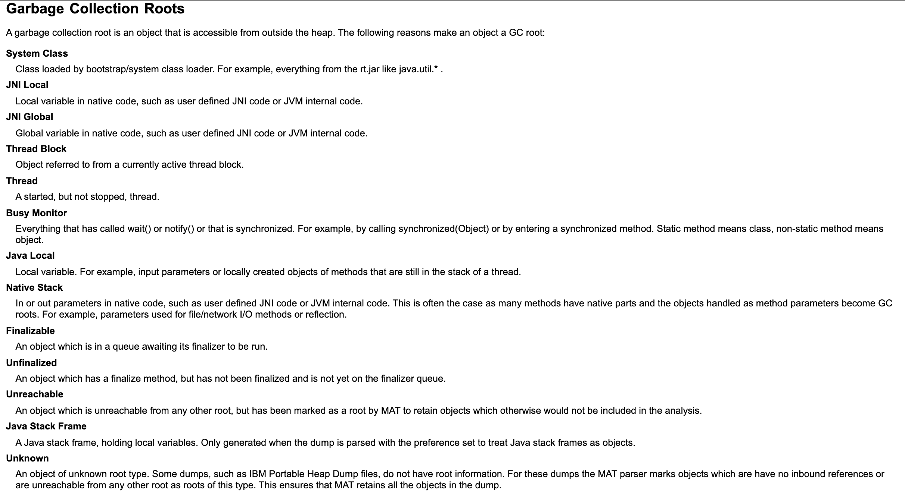
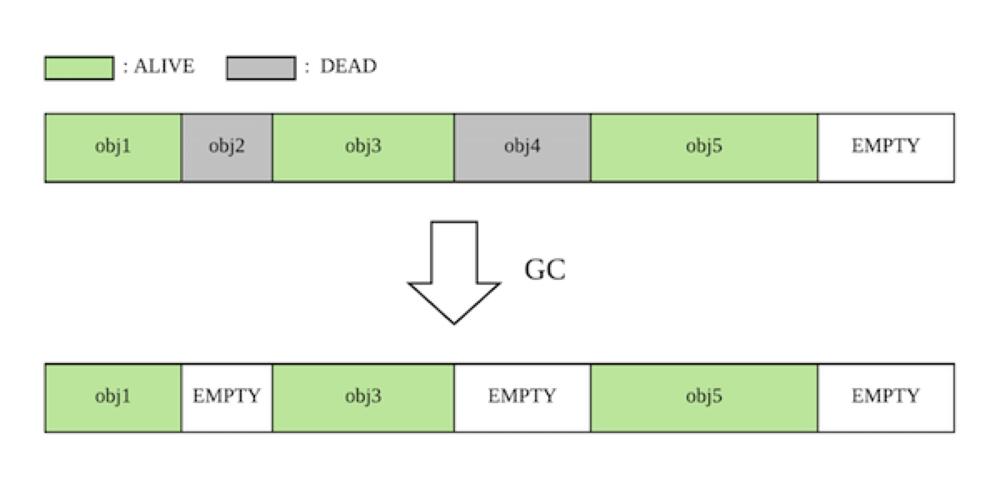

# CMS 垃圾回收器

## 总览
分析：首先要从概念上捋清楚，CMS 是 hotspot 虚拟机上的一个实现，并不是某种算法。它使用的算法是标记-清扫。但是它有一个特殊的模式，就是可以开启压缩，那么会在回收的时候清扫之后再压缩内存，减少内存碎片。这就是所谓的标记-清扫-压缩算法。

CMS 的面试，大多数时候来说，就是面一下算法的大概流程，并不会涉及特别多的细节——这些细节真的真的很多。

那么我们在面试 CMS 垃圾回收器的时候，要怎么刷出亮点？就是补充细节。

例如，大多数人只能说出，CMS 有初始标记-并发标记-再标记-清扫四个步骤。那么你可以补充预清理阶段。

这种补充细节是有很多个维度的。

另外一个刷亮点的地方，就是补充正向的内存分配。说清楚 CMS 使用了空闲链表来管理空闲内存，也使用了 TLB(Thread local buffer) 来分配内存。

另外一些面试题就是针对某个步骤来抠细节，或者针对使用过的数据结构来抠细节。

此外就是要熟练掌握一些 CMS 的控制参数，这些参数会影响CMS的效果和性能。本质上来说，这一类的问题，属于CMS的调优范围。

但是大体上来说，能够完全背下来流程，那么通过 CMS 垃圾回收器其实是不难的。

## 面试题

### 你了解 CMS 吗？

分析：基础题。这道题基本上面试官就是指望你回答出来 CMS 的基本特征，基本流程。

基本流程我们采用六步来回答，在一般意义上的四步里面引入额外的两步，并发预清理和并发重置。

并发预清理位于并发标记和最终标记之间。

并发重置则是最后一个步骤。

回答：（先回答基本特征）CMS 是一个基于标记-清扫（这是一个钓鱼的说法，因为面试官可能会怀疑你不知道它的压缩过程）算法的并发垃圾回收器，主要用于老年代回收。（这里就会引来其它问题，比如年轻代怎么回收，年轻代的回收和 CMS 是如何合作的）

（回答基本流程）CMS 的基本流程可以分成六个步骤（同样，这个步骤也没涉及到压缩步骤，是因为压缩步骤是一个可选的步骤，这里我们可以等面试官来问）：
1. 初始标记：主要是扫描 GC root （点明 GC root，这样面试官可能会进一步问你 CMS 里面的 GC root 有哪些），这个过程是 STW 的；
2. 并发标记：这个过程应用程序可以继续运行；
3. 并发预清理：该步骤主要是为了处理在并发标记阶段应用线程修改过的引用，减少后面重新标记的停顿时间；
4. 重新标记：STW 的，将并发阶段修改过的引用进行校正；
5. 并发清理：主要就是将空闲内存还给 CMS 的空闲链表（这里我们提及了空闲链表，是为了引来相关的问题）。（后面这一段，是点明一个问题，因为很多面试官其实不了解这个，不用指望他会问）如果在这个阶段，又有对象被分配到老年代，那么会被放到特定的链表的位置，因而不会被回收。
6. 并发重置：重置GC阶段使用的数据结构，以备下一次使用（这里我们没说有什么数据结构，也是因为如果面试官不了解就不会问，问了就可以继续说）

（注意，我们这里额外讨论了两个阶段，并发预清理和并发重置。其中并发预清理是重点，所以我们在回答的时候指出了引入这个阶段的目的，是为了减少重新标记的停顿时间）

#### 类似问题
- CMS的执行步骤？
- CMS使用了什么算法？
- CMS 有几次停顿？是哪几次？

（下面我们分不同的阶段来看看面试官会怎么问）

### CMS 的 GC root 有什么？
分析：之前在[总览](./algorithm.md)那里我们讨论过 GC root 大概有些什么。这里则是进一步细化了，在CMS这个回收期下，GC root 有一些什么。

其实我们大概都能够猜到主要的几个，比如说线程本身，线程栈上引用，本地方法栈上引用。然后还有一些稍微细想大概也能猜到的，比如说加载到的类，它持有的静态对象。

按照 Eclipse 的文档，它划分得非常详细：

我们先分个类：
1. Java 线程相关的：Java线程本身，Java的线程栈
2. 本地方法相关的：本地方法栈上变量，本地方法全局变量，本地方法局部变量
3. 类相关：系统类，类的静态变量
4. finalize 相关：finalize 是 JVM 管理的，所以也是 gc root
5. 同步相关：处于同步阻塞的对象。因为 JVM 的实现基本上都是把阻塞队列丢到一个本地（NATIVE）队列里面，所以它也不得不成为一个 gc root；
6. 其它

其实这几个子类，稍微想想都能理解，为什么它们会成为 gc root。

回答这个问题，入门是要答出1，2；进阶是要答出3，4，5。

所以亮点落在后面三个。

还有一个更加进阶的高级回答，是回答 CMS 如何处理年轻代指向老年代的引用。之前我们说过，跨代引用也会成为 gc root。比如说在 CMS 和 Parallel New 的组合之下，如果触发年轻代 GC，那么老年代指向年轻代的引用，是被记录在记忆集（卡表是它的实现）里面的，在 GC 启动的时候要扫描记忆集，找出这种跨代引用。

但是 CMS 是没有记录年轻代指向老年代的引用的。这意味着，在 CMS 启动的时候，它必须扫描整个年轻代才能找到所有年轻代指向老年代的引用。

这听起来就很可怕。但是考虑到我们有年轻代 GC，所以实际上 CMS 会等一段时间，如果这段时间出发了年轻代 GC，那么 CMS 扫描整个年轻代就变成了只需要扫描 Survivor 了。

所以我们的回答分成三段，依次递进。

答案：gc root 有很多。（先回答最常见的，线程和本地方法）最常见的就是线程本身和线程栈上对象（这是指引用），与之类似的是本地方法相关的，包括本地方法栈上对象，本地方法全局变量；（回答后面三种比较人知道的）而后还有系统类和类的静态变量，finalize 相关的，以及处于同步状态的对象。（一般是不需要解释为什么这三种也是 gc root，面试官如果没有提前了解的话，他也一时想不到为啥）

（高高级，讨论跨代）总而言之， gc root 可以理解为，所有的指向回收区域的外部引用。

比如说年轻代回收，需要扫描卡表找到老年代指向年轻代的引用；G1垃圾回收需要找到指向 Region 的外部引用。

（重点描述 CMS，当然如果你们之前的话题是G1，那就是重点描述G1，依次类推）而 CMS 则比较不一样，它因为没有记录年轻代指向老年代的引用，所以 CMS 需要扫描整个年轻代才能找到跨代引用。因此，CMS 会在准备启动 GC 之前等待一小段时间，看看这段时间内是否发生了年轻代 GC。如果发生了，那么 CMS 就只需要扫描 Survivor 区了。（这里也是埋伏笔，因为后面 GC 还可能问到，为什么我们要设置一些参数，以迫使 CMS 期间触发一些年轻代 GC）

（再进阶）该参数是`XX:CMSWaitDuration`，一般设置为覆盖一个年轻代GC周期。但是设置过长可能导致老年代空间完全耗尽。（这里我们只说完全耗尽，然后看面试官会不会问 promotion failed 之类的问题，他可能进一步会询问这会出现什么问题，但是这里，我们就暂时停下来，参考后面的**CMS 来不及回收老年代会发生什么事情**）

#### 类似问题
- CMS 如何处理年轻代？年轻代是用 Parallel New 来回收的，CMS 会利用年轻代 GC的结果来减少初始标记和再标记两个停顿过程

### CMS 并发标记阶段，如果引用发生了变更会怎样？

分析：这个要分开来说。首先 CMS 是只回收老年代和永久代的，那么年轻代对象之间的引用变更，CMS 是不会管的。因为后面 CMS 在最终的重标记阶段，还要重新扫描年轻代，所以这个阶段不用管。

而其它引用变更，大体上又分为两类，一个是年轻代引用指向老年代的引用变更，一个是老年代内部之间的引用变更。无论是这两种情况的哪一种，CMS 只会把内存标记为 Dirty，后面预清理阶段会进行处理。

答案：如果是年轻代之间对象应用发生变更，那么 CMS 在这个阶段不会做什么（这里引导面试官问你，最终 CMS 是在哪里处理的）。否则，CMS 会把内存标记为 Dirty，在预清理阶段和重标记阶段再次处理。

#### 类似问题
- CMS 并发标记阶段，创建了新对象，会发生什么？什么也不会发生，因为 CMS 不管年轻代，只是在后面重标记阶段重新标记年轻代对象；
- CMS 并发标记阶段，如果老年代引用发生了变化，会发生什么？CMS会重新把这块内存标记为 dirty，预清理和重标记阶段再处理一遍；
- CMS 并发标记阶段，如果年轻代指向老年代的引用发生了变化，会发生什么？和上面一样，把这块内存标记为脏，预清理和重标记阶段再来一遍；

### CMS 的预清理阶段做了什么？

分析：这个阶段看起来比较花里胡哨，具体来说，它可以是单独的预清理(Pre-clean)阶段，也可以是指预清理和可中断预清理两个阶段。

预清理的目标是降低停顿时间。它是为了解决并发标记阶段引用变化问题而引入的。从前面也可以看出来，CMS 一个重要的特征就是并发标记阶段，会发生应用变更。非年轻代的引用变更，CMS 会把内存标记为 Dirty。

如果我们考虑一下，要是没有预清理阶段，那么重标记阶段就需要全部 Dirty 的内存再标记一遍，如果应用很繁忙，那么可能很多内存都需要重新标记。

因此引入了并发的预清理阶段，这一个阶段就是处理这些 Dirty 的内存块。然后发现，这个预清理也是并发的，如果这个时候也有引用变更，岂不是又产生了新的 Dirty 内存块？是的，但是因为这个过程比较快，所以理论上产生的 Dirty 块要比较少。后面的可中断的预处理阶段，也是这么一个过程，但是为了避免无线套娃，所以它是可中断的。

答案：预清理阶段主要是处理在并发阶段标记为 Dirty 的内存块（具体来说，是卡表里面的卡被标记为 Dirty）。提前处理了这些 Dirty 内存块，那么重标记阶段就可以少处理一点内容，减轻停顿时间。

预清理阶段有一个可中断的预清理。该阶段是不断循环，循环内的步骤类似预清理阶段，不过除了处理 Dirty 的内存块，还会扫描年轻代，找到指向老年代的引用。

（进阶，讨论中断的条件）这个阶段是可以被中断的，中断的条件有三个：
1. 循环次数达到阈值；
2. 执行时间达到了阈值；
3. 新生代的 Eden 的内存使用率达到了阈值；

（这三个分别是三个参数控制，不过不太重要，不需要记住参数名字，前两个很好理解容易记忆，后一个记不住也没关系）

#### 类似问题
- 什么是预清理？
- 什么是可中断预清理？
- 什么时候会中断预清理？
- 为什么要中断？

### 重标记阶段，做了什么？

分析：重标记阶段主要是找出来并发阶段修改的引用，再一次处理一遍。

所以重标记不得不重新扫描 GC root、年轻代和 Dirty 内存块。

注意的是，重标记不会重新完全标记一遍，而是尽量缩小了标记范围。

答案：重标记阶段主要是为了处理并发阶段发生变更的引用。该阶段主要是重新扫描 GC root，年轻代和 Dirty 块。

（我们稍微讨论一下重标记停顿时间来源）大多数时候，该阶段的停顿时间主要是由扫描年轻代和 Dirty 造成的。因此为了降低这个阶段的停顿时间，我们可以调整预清理的参数，尽可能多在预清理阶段处理完，也可以开启参数`CMSScavengeBeforeRemark`，强制在重标记之前执行一次年轻代GC，以降低GC时间。

#### 类似问题
- 怎么降低重标记的停顿时间
- 为什么要在重标记之前执行一次年轻代GC

### CMS 来不及回收老年代会发生什么事情

分析：这其实考察的是 CMS的一个异常情况。回忆一下，什么时候会触发 CMS？除了第一次以外，其他时候都是JVM觉得应该GC了，就会触发GC。它会控制住GC频率，确保 CMS GC 发生期间，不会出现老年代空间不足的问题。

但是很显然，总有意外，于是就会出现 concurrent mode failure. 比如耳熟能详的 promotion failure。

那么在这种情况下，会出现什么问题呢？

当然就是整个 CMS 会失败，退化为串行GC。它使用的是古老的 Serial Old 来GC，整个过程都是 STW 的。

答案：会出现 concurrent mode failure（并发模式失败），于是退化为 Serial Old 来GC，GC 时间会猛增。

（接下来我们讨论一下为什么会出现这种情况，作为进一步解释，亮点一。这也是一个单独可能出现的面试题）一般出现是两种情况，年轻代 GC 提升对象失败，或者超大对象直接分配在老年代失败。更深层次的原因可能是年轻代 GC 太频繁，导致对象被迅速提升到老年代，也可能是老年代碎片太严重，导致找不到足够大的连续内存来容纳对象。

（接下来讨论解决方案，亮点二。这也本身就是一个面试题）我们需要尽量避免这种出现情况：
1. 大多数时候，最简单的方案是增加堆的大小；
2. 其次我们可以调整老年代和年轻代的比例，但是调大老年代的比例意味着年轻代GC更加频繁，治标不治本；
3. 让 CMS GC的时候整理内存，即触发压缩过程。即设置`-XX:UseCMSCompactAtFullCollection`和`-XX:CMSFullGCBeforeCompaction=5`参数。这个过程会导致更长的STW时间（压缩的过程是STW的）；同时`CMSFullGCBeforeCompaction`这个参数，过小会导致频繁的内存压缩，性能很差；
4. 设置`-XX:CMSInitiatingOccupancyFraction=70`和`-XX:+UseCMSInitiatingOccupancyOnly`参数，即让 JVM 永远在使用量达到我们设置的阈值的时候就开始CMS（这里是70%）

#### 类似问题
- 如何解决 CMS 内存碎片？还能咋的，只能是开启压缩了。主要是解释`CMSFullGCBeforeCompaction`参数过大过小会有什么问题；
- `CMSInitiatingOccupancyFraction`参数有什么作用？告诉JVM**第一次**CMS在使用了多少内存后开始GC，如果配合`UseCMSInitiatingOccupancyOnly`则是让JVM永远使用我们设置的比率，而不必自适应计算
- 什么是 concurrent mode failure？有什么后果
- 什么是 promotion failure？有什么后果
- 过早 promotion 会有什么后果？容易导致 Full GC，容易导致 promotion failure

### CMS 为什么会有内存碎片

分析：综合考察内存正向分配和GC回收。这道题还是比较有水平的。首先要先揭示CMS的内存管理，核心就是两点：标记清扫和空闲链表。

我个人认为是标记清扫这种特性决定了空闲链表这种管理空间内存的方式。

答案：原因在于 CMS 使用了标记-清扫的内存回收算法，和空闲链表的内存管理方式。每一次 CMS GC 之后，幸存的对象会把连续内存划分成一段段，

多次 GC 之后，就会导致所有的空闲内存都很小，以至于明明还有很多空闲内存，但是却找不到任何一块足够大的内存来存放新对象。这就是内存碎片。

（其实这里还有一种可能，是面试官问的其实是并发过程中产生的浮动碎片，其实就是该被回收的没被回收，但是大多数时候，是指这个清扫导致的内存碎片化）

（接下来我们讨论解决方案，在前面提到过，就是`UseCMSCompactAtFullCollection` 和 `-XX:CMSFullGCBeforeCompaction` 参数）我们可以通过设置`UseCMSCompactAtFullCollection` 和 `-XX:CMSFullGCBeforeCompaction`参数来控制 CMS 执行压缩，并且控制在多少次 GC 触发一次压缩。

#### 如何引导
- 讨论到正向的内存管理
- 讨论到操作系统内存管理
- 讨论到指针碰撞
- 讨论到为什么要压缩

#### 类似问题
- 为啥老年代明明还有空闲内存，却触发了 Full GC？碎片太多，找不到足够大的连续的空闲内存；又或者 CMS 预估到接下来这点空闲内存不够了，需要提前触发GC（时间间隔轮询做这种判断）
- CMS 为什么要压缩

### 什么时候会触发 Full GC？

分析：考察触发 Full GC的点。在 CMS的语境下，则是考察 CMS 触发的时机。一般人的回答都是从promotion failed这种角度，虽然也对，但是不够完整，严格意义上来说，CMS 的触发，有两种方式，一种是定时轮询，判断要不要 GC（这种其实严格来说，不是 Full GC，是 Major GC。不过国内的语境之下，经常会把 Major GC 和 Full GC 混为一谈）；一种就是刚才提到的，`promotion failed` 这种不得不触发的时机。前者我们叫做主动触发，后者叫做被动触发。

主动触发的面试亮点在于，要阐述清楚，CMS 是如何轮询的，有什么参数可以控制；被动触发则是列举场景。

主动式轮询，有一个参数控制时间间隔。而后，老年代使用率达到阈值，触发GC；开启了回收永久代的时候，永久代使用率达到阈值，也触发GC。

被动触发其实很容易记住，就是对象尝试分配到老年代的时候，如果发现老年代找不到一个内存来放对象，那么就会触发GC，这个时候都是退化为串行的 Serial GC。

答案：CMS 触发时机有两种，主动触发和被动触发。

主动触发是指，CMS 会轮询，判断当前是否需要 GC。（基本回答）CMS 会在老年代内存使用达到一个阈值的时候，开始 GC；又或者在开启了回收永久代的时候，永久代内存使用率触发阈值，触发GC。（进阶）还有两个参数`CMSInitiatingOccupancyFraction` 和 `UseCMSInitiatingOccupancyOnly` 都设置了的话，那么 CMS 的阈值就会使用设置的值，否则是使用默认值。（据我了解是会动态调整）

被动触发，核心在于对象分配到老年代的时候找不到空闲内存来容纳（这时候，可能是充满了碎片，所以没有连续的足够大的内存来容纳，也可能是确实是都用完了）。而对象分配到老年代，就是晋升失败，或者大对象直接分配失败。

（后面可以将话题引导到 promotion failed 的后果，就是面试题**CMS 来不及回收老年代会发生什么事情**）

#### 类似问题
- CMS 是否回收永久代？CMS 可以用于回收永久代，但是参数得配置开启
- CMS 什么时候会退化为 Serial GC？

#### 如何引导
- 反正讨论到了 CMS，Full GC 都可以聊这个
- 可以结合 G1 垃圾回收器，来对比两者的触发时机

### CMS 采用的空闲链表方式管理内存，存在什么缺点？

分析：本质上，这应该算是内存管理的面试题，因为别的，例如操作系统，如果也采用了空闲链表，那么也会有这个问题。

就是碎片和内存分配低效两个问题。

答案：主要有两个方面，内存碎片和内存分配低效。

（如果之前没有聊过内存碎片，这里可以补充一下什么叫做内存碎片）CMS 的内存管理方式会导致这么一个问题，内存被分割为一个个零散的小块，这些小块可能太小，以至于无法容纳任何对象，导致内存利用率低。

而空闲链表这种管理方式，导致内存分配的时候，需要查找可用内存，然后再分配，效率极低。

#### 类似问题
- 为什么CMS分配内存比较慢
- CMS用了指针碰撞技术吗？显然没有

#### 如何引导
- 聊到空闲链表都可以说

### CMS 有什么缺点

分析：CMS 的缺点是极为明显的。最容易想到的就是内存碎片问题，不过很少有人会回答道内存碎片带来的影响。

另外就是 CMS 会出现并发模式失败的可能，也就是退化为 Serial GC 的可能性。

最好就是 CMS 的停顿时间，比 G1 之类的长。它的两次标记，初始标记和重标记，都和年轻代存活对象有关，因此为了避免 CMS 的停顿时间，我们会尝试开启一个参数：
`CMSScavengeBeforeRemark` 在重标记之前执行依次年轻代 GC，这样能显著降低 GC 停顿时间。也因此 CMS 不适用于大堆（有些人说 6G 以上，有些人说 8G 以上就不要用 CMS了，我觉得是跟应用特征相关）

答案：CMS主要有三个缺点：
1. 内存碎片。这导致 CMS 内存使用率比较低（总有一些碎片无法被利用），（补充空闲链表，作为亮点）而且 CMS 使用了空闲链表来管理空闲内存，导致内存分配相比指针碰撞，要慢很多；
2. CMS 存在并发模式失败的可能，这会导致 CMS 退化为 Serial GC，性能极差；（这里可能面试官问什么时候会导致并发模式失败）
3. CMS 不适用大堆。CMS 的停顿时间相比 G1 还是比较长的，（补充一下重标记的问题，引导面试官问重标记问题）我们可以通过开启`CMSScavengeBeforeRemark`来确保重标记之前，能够触发一次 Young GC，来减轻 CMS 的停顿时间

#### 如何引导
- 讨论到并发模式失败
- 讨论到重标记
- 讨论到空闲链表

#### 类似问题
- CMS 适合什么场景

## Reference
[Oracle documents - CMS](https://docs.oracle.com/javase/8/docs/technotes/guides/vm/gctuning/cms.html)
[Java gc roots](https://help.eclipse.org/2021-06/index.jsp?topic=%2Forg.eclipse.mat.ui.help%2Fconcepts%2Fgcroots.html&cp=37_2_3)
[CMS](https://juejin.cn/post/6844903740864987149)