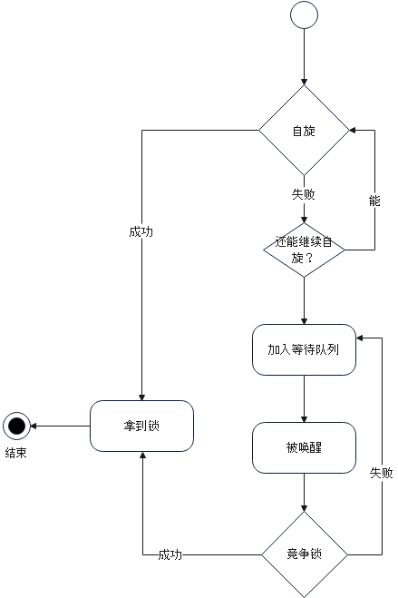
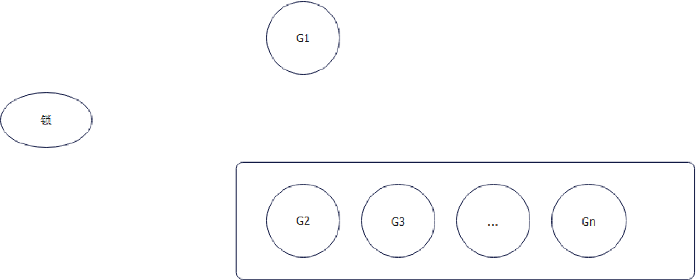

# Mutex 

## 面试题

### `mutex`是如何加锁的

分析：也是考察`mutex`的实现原理。基本上就是围绕`自旋-FIFO`来说的。简单理解就是，`mutex`先尝试自旋，自旋不行就所有`goroutine`步入`FIFO`，先到先得。

在大多数的锁实现里面——不仅仅是 Go 的 mutex 都是有套路的：

所以基本上就是两步：
- 自旋加锁，所谓的自旋也就是 CAS 操作，将锁从无锁状态修改为加锁状态。自旋这个过程一般可以可通过控制自旋的次数或者时长来控制；
- 自旋失败之后就进入队列，等待释放锁的时候被唤醒；

但是 Go 有一点特殊，即 Go 有所谓的正常模式和饥饿模式。为了理解这个问题，要先看这么一个问题：

如果锁此时已经被释放了，那么你作为一个设计者，你会把锁给谁？

- 给 G2：毕竟我们要保证公平，先到先得是规矩，不能破坏
- G1 和 G2 竞争：保证效率。G1 肯定已经占着了 CPU，所以大概率能够拿到锁

所谓的正常模式，就是 G1 和 G2 竞争的模式。这种模式下，G1 拿到锁的概率远远大于 G2，因为此时 G1 是占据着 CPU 的。从这个角度来说，这也是为什么 Go 设计成 G1 和 G2 竞争的模式，因为这样可以避免 goroutine 的调度。

那么问题就成了，G2 可能等来等去一直抢不到锁，每次都被新来的抢走锁。为了解决这个问题，Go 就引入了所谓的饥饿模式。在饥饿模式下，锁必然会被交给 G2。

当等待队列为空的时候，或者 G2 等待的时间不够 1ms，就退出饥饿模式。

答案：`mutex`加锁大概分成两种模式：
1. 首先 mutex 会尝试自旋直接加锁。如果自旋失败，那么 goroutine 就会被加入到等待队列里面等待唤醒；
2. 如果队头 goroutine 被唤醒，那么要看此时 mutex 的状态。如果此时 mutex 处于饥饿状态，那么锁会别直接移交给队头 goroutine；如果此时是正常状态，那么队头 goroutine 和最新的请求锁的 goroutine 进行竞争
3. 在正常模式下，因为最新请求锁的 goroutine 此时占据着 CPU，那么它大概率能够拿到锁，那么队头的 goroutine 等待 1ms 都拿不到锁，mutex 就会进入饥饿状态
4. 等到队列中的 goroutine 都被清空了，或者队头等待时间不够 1ms，就会退出饥饿状态
   
（讨论一下公平性的问题）所以从严格意义上来说，它并不是公平锁，因为在正常状态下，一个新的请求锁的`goroutine`和等待的`goroutine`一起竞争锁。而严格意义的公平应该是永远遵循 `FIFO`。

#### 类似问题
- Go mutex 的两种状态？
- 什么是饥饿状态？
- 什么时候进入饥饿状态，什么时候退出饥饿状态？
- mutex 是不是公平锁？显然不是

## Reference
[mutex is more fair](https://news.ycombinator.com/item?id=15096463)
[这可能是最容易理解的 Go Mutex 源码剖析](https://segmentfault.com/a/1190000039855697)
