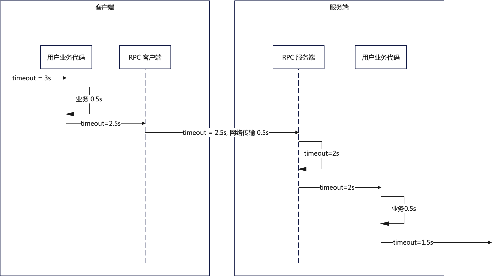

# 超时控制

分析：超时控制在微服务里面，是一个咋一看很容易，但是讨论起来又可以在平凡之中刷出足够亮点的话题。

超时控制最基本，也就是大多数人能够想到的超时控制也就是 A 调用 B，然后超时是 3s 这种超时。那么想要把超时控制回答好，那么就需要深入理解这几个话题：
- 为什么要做超时控制？需要举例子说明超时控制没做，会有什么影响；
- 超时控制怎么做？这里面我们会进一步细分单次调用的超时控制，以及在这个基础上的全链路超时控制是如何实现的；
- 超时之后能否中断正在执行的业务逻辑；

## 面试题

### 为什么要做超时控制？
分析：如果单纯从理论上来说，那么可以总结为客户端总是希望在预期的时间内拿到响应的，而不管这个响应是正常响应还是异常响应。那么超时就是为了保证这一点。在超时控制里面还有一种比较特殊的形态，即链路超时控制。例如在 A -> B -> C -> D 的时候在整条链路上设置一个超时时间。例如在起点 A 处设置一个超时时间 1s，那么意味着在 A 收到请求到 A 从 B 中拿到响应的整条链路，超时时间不能超过 1s。这种链路超时控制，也可以看作是为了让调用者在确定的时间段内拿到响应。只不过这个调用者就是用户本身。

从另外一个角度来说，超时也是为了节省资源。我们可以预期的是，在超时之后，后续的步骤应该会被中断掉，并且及时释放资源，例如 TCP 连接，数据库连接之类的。

所以总结，超时控制的目标：
- 让调用者能够在预期的时间内拿到响应。而在链路超时控制里面，则是希望用户可以在确定的时间内拿到响应，提升用户体验。
- 及时释放资源

为了增强说服力，可以额外举例子，两种做法带来的后果：
- 例如在 APP 首屏的请求里面设置整个链路超时时间不超过 100ms，这会迫使后端去优化程序性能以满足这种性能要求
- 缺乏超时控制（或者超时时间设置得不对）会引起资源泄露。例如在微服务调用里面，如果没有超时控制，那么发起调用的 goroutine 会被阻塞，直到拿到响应。又或者在 DB 查询里面，没有超时控制，在数据库性能偶然抖动的情况下，可能导致数据库连接消耗干净，同时引起 goroutine 泄露。

注意，这里我们说 goroutine 泄露，是 Go 专属的。Java 之类的语言，依赖的是线程，那么缺乏超时控制会不会导致线程长期阻塞，则取决于语言细节，以及框架的线程模型。

可以认为，最基础的回答就是答出两条核心目标，刷亮点则在于解释如果超时控制设置不当会有什么后果。对于 Go 语言开发来说，这也是一个典型的可能引起 goroutine 泄露的场景。

答：（基本回答）超时控制一般是为了两件事：
- 确保调用者能够在预期的时间内拿到响应，即便是一个超时响应也好过完全没有响应。例如 APP 首页等关键 API 上，在链路超时控制（这里是一个引导，因为面试官可能接下来就是面你链路超时控制机制了）里面，设置整条链路的超时时间不超过 100ms。
- 及时释放资源。例如在 RPC 调用里面或者数据库查询里面，设置超时时间。如果没有设置的话，那么 goroutine 或者连接之类的东西一直被占用，引起资源泄露，即 goroutine 泄露或者连接无法被复用（在这个地方要小心，如果面试官捕捉到了 goroutine 泄露这几个关键字，那么可能会进一步考察 goroutine；如果面试官捕捉到了连接复用几个关键字，那么可能会进一步面连接复用的原理）。

#### 类似问题
- 超时如果没有设置，或者值没有设置好，会出现什么问题？要注意，超时没设置，或者设置过长，会浪费资源，典型例子就是 goroutine 长时间得不到释放（或者 TCP 链接长时间被占用）。但是过短也不行，因为过短意味着你会经常超时，而没有办法拿到正常的响应

### 如何计算超时时间？
分析：这个问题是指，假如说你要发起一个 RPC 调用，A->B，那么设置多长的超时时间比较好。这个东西，要从两个角度考虑：
- 从用户体验的角度考虑
- 从开发者的角度

从政治正确的角度来说，那么肯定是从用户体验的角度来考虑的。也就是说如果产品经理觉得用户只能等待一秒，那么意味着你的接口的超时时间就应该是一秒。一秒内，不管你有没有处理完毕，拿到正常的响应，你都要明确告诉用户。也就是用户体验上的一个原则：一个坏消息都好过没有消息。这也就是说，超时时间完全不是由我们研发人员控制的，而是纯粹的一种用户体验设计上的事情。

当时实际上，受制于产品经理的水平，以及技术架构的缺陷，我们并不能总是站在用户体验的角度考虑超时时间。这种情况下，超时时间就只能是依赖于研发人员去确认了。

对于一个已经上线的接口来说，例如 B。那么 A 调用 B 的超时时间可以设置为 99 线，或者 999 线。这取决于公司的可用性目标。不过有两个值是肯定不能用的，中位数或者平均值。中位数意味着一半的请求会超时，而平均值则是接近一半的请求会超时。

对于一个没有上线的接口来说，因为不知道 99 线或者 999 线，那么这个时候就可以通过压测来确定这两个值。如果无法压测，那么只能根据代码来手动分析。例如说如果一个数据库查询大概是 10ms, 而 B 接口发起了三个数据库查询，那么至少要 30ms，从容估算的可以取 100ms。

这个东西很像计算限流阈值。所以你可以在面试的时候顺便引导过去限流。应该说，跟响应有关的数据基本上都可以通过这种方式来确定。

最后要强调一下超时时间只是一个建议值，例如说设置了1秒钟作为超时时间，那么可能1.2秒才最终超时。这就引申出来时间精确度的问题，时间精确度这个是和语言相关的。

答案：计算超时时间可以考虑从两个角度考虑：
- 从用户体验的角度考虑，也是最佳方案（不得不吐槽，这就是政治正确的说法，面试官绝对不敢说不对）。那么可以要求产品经理给出具体的超时参数，比如说用户能够最多容忍这个接口多长时间内返回数据
- 否则的话，我们研发人员可以考虑自己确定超时时间。如果是调用一个已有的接口，那么可以利用观测到的响应时间数据，选用 99 线或者 999 线来作为超时时间。（稍微刷一下亮点）但是不能选用中位数或者平均值之类的，因为这意味着有相当多的请求会超时。而如果一个接口还没有上线，那么可以考虑压测来确定超时时间（这里你可以稍微提一下，限流的阈值也可以通过压测来确定。那么话题就可能引向限流）。如果连压测也做不了（这并不稀奇，能够随时执行压测的公司是凤毛麟角），那么只能通过代码分析来确定超时时间。例如说 B 接口上有三次数据库查询，如果每次数据库查询的时间是 10ms，那么就可以估计 B 数据库查询就要花掉 30ms，再预留一些 buffer，就可以认为调用 B 的超时时间在 100ms。

（如果你记得你使用的语言，或者你面试的语言时间精度问题，就在这里接着刷亮点）大多数时候，我们并不能预期系统或者中间件的超时处理是很精确的，这主要是源于巴拉巴拉（转到讨论不同语言的时间精度问题）

#### 相关问题
- 如何确定限流阈值
- 时间精度问题

### 怎么实现超时控制？
分析：一般来说，其实不太会直接问怎么实现超时控制，一般都是问怎么实现链路超时控制。

我们的回答也分成两块：
- 和语言相关的进程内超时控制。例如在 Go 里面基本上就是利用 context.Context 来实现进程内超时控制；
- 全链路超时控制；

重点放在全链路超时控制上。全链路超时控制核心要解决：
- 计算剩余超时时间
- 跨进程传递剩余超时时间

首先我们看一个例子：

基本步骤是：
- 客户端最开始的时候，链路超时时间是 3s。一般在 BFF 里面会设置好整个链路的超时时间，而后逐步传递；
- 客户端自己业务花掉了 0.5s，那么链路剩余超时时间就是 (3-0.5) = 2.5s 了；
- 客户端准备发起 RPC 调用，RPC 客户端将剩余超时时间编码进去请求里面，传递到服务端；
- RPC 服务端收到请求之后，发现剩余超时时间是 2.5s，但是网络传输花了 0.5s（怎么知道花了 0.5s），那么剩余超时时间就是 2s；
- RPC 服务端将请求和剩余超时时间都交给用户的业务代码，业务执行花掉 0.5s，那么还剩下 1.5s；
- 接下来，不管服务端要继续调用 RPC 服务，还是要调用 http 接口，都要将 1.5s 继续传递下去；

所以可以注意到，整个链路超时控制，其实沿着整条调用链路，将剩余超时时间一层一层传递下去，每一个步骤都要严格控制自己的超时时间不能超过整个链路的剩余超时时间。

在进程间，或者说跨网络传递超时时间主要依赖于采用的通信协议。例如说如果我们的微服务是依赖于 gRPC 的，那么这个链路剩余超时时间是在 gRPC 底层的 HTTP 头部中传递。而如果我们采用的是 Dubbo 协议，那么链路剩余超时时间是在 Dubbo 协议的 attachment 部分传递的。（虽然 Dubbo 协议本身有一个超时的字段，但是好像并没有用来做链路超时控制，存疑）。如果是其它协议，那么就要看具体的协议设计了。一般来说都是在协议的元数据中传递。如果你知道面试官公司用的是什么协议，那么你可以提前了解一下面试官使用的协议是否支持链路超时控制，如果支持的话，那么它的剩余超时时间是怎么在网络之间传递。

在这种超时控制下，还有一个细节，就是客户端调用服务端的时候，谁来控制这个超时？
- 在客户端计时：也就是客户端自己有一个计时器，时间到了就认为超时了，而后不会再管服务端的响应
- 客户端和服务端同时计时：也就是客户端有一个计时器，时间到了就给用户代码一个超时响应；而服务端也有自己的计时器，如果服务端超时了，那么服务端将直接返回一个超时响应（其实也可以什么响应都不返回，因为服务端可以认为客户端早就已经返回了）。相比之下，因为服务端也维持住了计时器，所以超时之后服务端可以及时释放资源（主要是连接）

唯一要注意的就是，超时控制是不能仅仅在服务端这边控制的。假如说只在服务端这边有一个计时器，然后超时了，那么服务器返回的超时响应，很可能在半路就丢掉了，而客户端根本没有收到。

另外一个问题是传递的超时时间，究竟是什么？
- 第一种传递的方案就是直接传递剩余超时时间，也就是我们在图里面画的，1.5s 这种。不过大多数时候不是直接传这种字符串，而是传数字，例如以毫秒作为的数字。这种方案的缺陷在于难以计算网络传输时间。如果面试问到怎么计算，那么标准答案依旧是测试，在平均请求大小的情况下，完全复刻线上环境，测试两个节点之间通信的延迟。一般来说，除非是跨城市机房通信，或者跨国通信，否则相比超时时间，网络传输时间基本可以忽略笔记；
- 第二种传递的方案就是传递超时时间戳。超时时间戳一般来说传递 64 位数字就可以。但是如果想要使用更少字节来传输，那么可以考虑使用毫秒数，并且该毫秒数不需要从 1970 年开始计数，而是可以用最近的，比如说从 2020 年开始的。这种方案并没有什么缺陷，只不过如果时钟不同步的问题比较严重的话，那么可能导致超时控制不准。但是一般超时时间至少都有几十毫秒，很少有时钟不同步会在几十毫秒这个量级；

总结起来，如果你想要回答好这个问题，就要讲清楚：
- 链路超时控制的大概流程
- 链路超时控制在哪一边控制
- 剩余超时时间是怎么传输的
- 剩余超时时间在网络中传输，传输的究竟是什么？

回答：
超时控制大体上分成两种，一种是进程内的超时控制，一种是链路超时控制。进程内的超时控制是和语言相关的，例如说在 Go 里面就是采用了 context.Context 来控制超时。

而链路超时比较复杂。（先把整个流程大概说一下）举例来说，在调用链路 A -> B -> C 中，如果 A 设置了整个链路的超时时间是 3s，如果 A 本身花了 0.5s 调用，然后发起调用 B，网络传输花了 0.5s，那么 B 收到请求之后剩余的超时时间就剩下 2s，如果 B 本身花费了 0.5s，而后发起调用 C，如果网络传输也花了 0.5s，那么 C 收到请求之后剩余超时时间只有 1s 了。

一般来说，对于不支持链路超时控制的微服务框架来说，它们只需要在客户端维持一个计时器。在超时之后直接返回一个超时响应。而支持链路超时控制的微服务框架，那么可以选择同时在客户端和服务端计时。（这里不要继续回答下去，等面试官问为什么要在服务端也启动一个计时器，核心就是为了释放连接，不需要将相应写回给客户端）。

（开始讨论细节，也就是刷亮点了，首先讨论怎么传递链路超时控制）在链路超时控制中，关键的一点是每一次发起调用的时候，都需要计算剩余超时时间，而后将剩余超时时间传递给服务端。（开始展示自己的知识面广）一般来说，RPC 协议里面都会预留一个部分，用于传递链路元数据，链路剩余超时时间就属于链路元数据的一部分。例如在 gRPC 里面，链路剩余超时时间是在 HTTP 协议的头部中传递的。

（继续讨论传输的内容）大部分情况下，剩余超时时间都是传递毫秒数，而后服务端收到请求之后减去网络传输时间（这里依旧是引导面试官问怎么确定网络传输时间，也就是在分析中说的，测试，注意要跟面试官强调剩余超时时间一般都很大，那么只要不是跨大陆或者跨国通信，那么基本可以忽略不计），得到的就是服务端剩余超时时间。

另外一种做法是传递超时时间戳，（这里是刷亮点）超时时间戳可以选在从 2020 年开始的时间戳，并且以毫秒为单位，这样四个字节就够了。（紧接着继续刷亮点，讨论时钟同步问题）这种方案的隐患在于如果时钟不同步的话，超时控制会不准确（本来就不准确，那么面试官就可能问你为什么超时控制不准确，你就可以看**如何计算超时时间**中的讨论）。不过相比超时时间几百毫秒，时钟不同步的那一点点误差，完全可以忽略不计。

#### 相关问题
- 本地超时控制是怎么做的？如果从本质上来说，都是依赖于时钟中断，剩下的就是不同语言机制就不太一样了
- 什么是全链路超时控制？
- 怎么在链路中传递超时时间？要回答两个点，不同协议是怎么传的和传递的究竟是什么，注意刷亮点