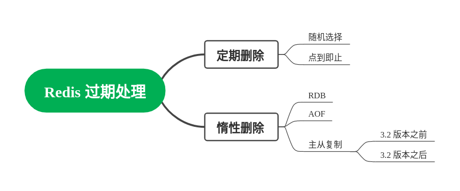

# Redis 过期处理

分析：Redis 对过期键值对的处理，可以说是日经题。核心就是懒惰删除+定期删除。前者很容易记忆，后者很容易忽略。而要刷亮点，要从 RDB， AOF 和 主从复制三个不同处理策略上着手。

答案： Redis 删除过期键值对，主要依赖于两种方式，定期删除和懒惰删除。

定期删除是指 Redis 会定期遍历数据库，检查过期的 key 并且执行删除。它的特点是随机检查，点到即止。它并不会一次遍历全部过期 key，然后删除，而是在规定时间内，能删除多少就删除多少。这是为了平衡 CPU 开销和内存消耗。

（扩展点一，和 JVM 的 G1 垃圾回收器做对比，它们的类似点在于部分回收）这有点类似于 JVM 的 G1 垃圾回收器，G1 也是挑选一部分 Region 来回收，不过 G1 主要是为了平衡停顿时间。

Redis 的另外一个删除策略是懒惰删除，即如果在访问某个 key 的时候，会检查其过期时间，如果已经过期，则会删除该键值对。

（扩展点二，结合 RDB， AOF 和 主从复制来回答）

如果 Redis 开启了持久化和主从同步，那么 Redis 的过期处理要复杂一些。
1. 在 RDB 之下，加载 RDB 会忽略已经过期的 key；（RDB 不读）
2. 在 AOF 之下，重写 AOF 会忽略已经过期的 key；（AOF 不写）
3. 主从同步之下，从服务器等待主服务器的删除命令；（从服务器啥也不干）

(扩展点三，讨论不同版本从服务器对过期 key 的处理策略)
如果 Redis 开启了主从同步，那么从库对过期 key 的处理，不同版本有不同策略。对于写来说，从库都是等主库的删除命令，但是对于读来说：
- 在 3.2 之前，Redis 从服务器会返回过期 key 的值，仿佛没有过期一样
- 在 3.2 之后，Redis 从服务器会返回NULL，和主库行为一致

（扩展点四，讨论 3.2 版本之前，读取从库过期 key 的策略）
在 3.2 之前，可以使用`TTL`命令来判断 key 究竟有没有过期。

#### 类似问题
- 为什么 Redis 定时删除策略不删除全部过期的 key？
- Redis 的定时删除策略是怎样的？
- 为什么有时候 key 已经过期了，但是还能读到数据？
- 如何解决 Redis 从库 key 过期依然返回数据的问题？