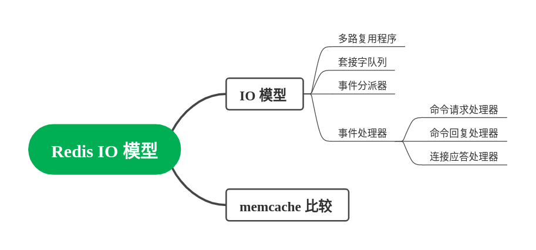

# IO 模型

分析：所有的 IO 模型，考来考去就是一句话，**IO多路复用**。因为操作系统就那么一回事，你要高性能，就没啥选择，反正别问，问就是`IO 多路复用`。那么为什么大家还问呢？因为`IO 多路复用`大体上大家都是差不多的，但是细节上就五花八门。回答 Redis 的 IO 模型，亮点可以从两个角度刷，一个是和`memcache`的比较；一个是从 6.0 支持多线程角度刷。

核心就是四个组件。

答案：Redis 采用的是 IO 多路复用模型，核心分成四个组件：
1. 多路复用程序
2. 套接字队列
3. 事件分派器
4. 事件处理器。事件处理器又可以分成三种，连接处理器，请求处理器，回复处理器。

（事件处理器怎么记住这三个呢？按照“发起连接——发送请求——发回响应”三个步骤，刚好对应三个处理器）

（大概描述一下各个组件是怎么配合的，大致就是生产者——消费者模式）

多路复用程序会监听不同套接字的事件，当某个事件，比如发来了一个请求，那么多路复用程序就把这个套接字丢过去套接字队列，事件分派器从队列里边找到套接字，丢给对应的事件处理器处理。

（扩展点一，讨论 6.0 引入的多线程模型）

Redis 这种模型的瓶颈在于从套接字中读写数据。因此在 6.0 中引入了异步 IO 线程，专门负责读取 IO 数据。在这种模型之下，相当于主线程监听到套接字事件，找到一个 IO 线程去读数据，之后主线程根据命令，找到对应的事件处理器，执行命令。写入响应的时候，也是交给了 IO 线程。这就是相当于，有一个线程池，只负责读写数据，主线程负责轮询和执行命令。

（扩展点二，讨论`memcache`的 IO 模型）

`memcache` 的 IO 模型本质上是 IO 多路复用。所不同的是，`memcache` 的 IO 多路复用是多线程的，并且命令的执行也是多线程的。`memcache`的`acceptor`线程监听到套接字事件之后，丢给`workers`线程，线程负责读写数据并且执行命令。

（扩展点三，结合扩展点二，进一步比较 Redis 多线程和 `memecache` 多线程）
在 Redis 6.0 支持多线程 IO 之后，两者的 IO 模型看上去其实差别不是特别大了。根本的差距，在于 Redis 依旧是只有一个单线程来执行命令，但是 `memcache` 是各自线程执行各自的命令。

#### 类似问题
- Redis 为什么引入多线程模型？
- Redis 一定是单线程的吗？
- Redis 是如何保证高性能的？（这里只讨论了一个点，还有别的点）

#### 如何引导
- 讨论 Redis 为什么那么高效
- 讨论到多路复用
- 讨论到 IO 模型
- 讨论到“Redis一定是单线程的吗”这种问题
- 讨论到了`memcache` 和 Redis 的区别

## References
[Redis 多线程解密](https://segmentfault.com/a/1190000039223696)