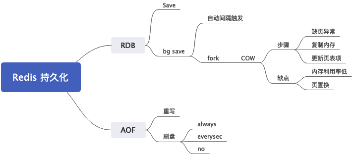

# Redis 的持久化机制

分析：Redis 持久化机制，其实还是比较简单的，就是 RDB 和 AOF 两种，掌握各自的特点和适用场景，然后背一下 AOF 重写的流程，差不多就可以了。如果要刷出亮点，在于两个点，COW 和 `fsync`的时机。前者是和操作系统相关，`fork` 调用有关；后者是横向对比其它中间件的持久化机制，比如说MySQL 的 `redolog`, `binlog` 都有类似的机制。如果直接问起来持久化机制，可以只先回答大概，把关键知识点点到就可以，后面等面试官来挖。

进一步，我们可以拿 Redis 的 AOF 机制和 MySQL 的 `binlog` 进行对比，它们都记录的是中间执行步骤。而 MySQL 的`mysqldump`就非常接近 `RDB`，也是一种快照保存方案。

答案： Redis 的持久化机制分成两种，RDB 和 AOF。

RDB 可以理解为是一个快照，直接把 Redis 内存中的数据以快照的形式保存下来。因为这个过程很消耗资源，所以分成 SAVE 和 BG SAVE 两种。（后面这个，是点出来 COW，如果你无法理解 COW 机制，就不要回答）BG SAVE的核心是利用`fork` 和 `COW` 机制。

AOF 是将 Redis 的命令逐条保留下来，而后通过重放这些命令来复原。我们可以通过重写 AOF 来减少资源消耗。（重写AOF，这个是钓鱼，是为了引导后面的两个话题，为什么要重写，以及如何重写）

#### 如何引导

这里面有一个很出人意料的引导的点，就是分布式锁。看后面**使用 Redis 来作为分布式锁，会有什么问题？**

## 扩展点

### BG SAVE是如何工作的？

分析：明面上是考察BG SAVE，实际上是考察 COW。所以亮点就在于把 COW 说个大概。思路就是从`fork`系统调用谈起，谈到 COW，再谈到 COW 内部的大概步骤。另外一个方向是结合 Java 的`CopyOnWrite`数据结构一起聊。

答案：BG SAVE 是为了解决 SAVE 资源消耗过多的问题（这一句是点出目标）。BG SAVE核心是利用`fork`系统调用，复制出来一个子进程，而后子进程尝试将数据写入文件。这个时候，子进程和主进程是共享内存的，当主进程发生写操作，那么就会复制一份内存，这就是所谓的 COW。COW 的核心是利用缺页异常，操作系统在捕捉到缺页异常之后，发现他们共享内存了，就会复制出来一份。（这里，如何发现共享内存，检查的是页表项，记不住没关系，认怂就可以。关键点在于缺页异常。）

（下面是结合 Java `CopyOnWrite` 来阐述，不熟悉 Java 这一类数据结构的请忽略。我猜测其它语言或者工具也会有类似的机制，可以挑一个深入描述，作为一种对比）
Java 里面也有一大类数据结构，利用了 COW 这种思想，例如 `CopyOnWriteArrayList`，当里面元素变更的时候，就会复制出来一个新的。它特别适合那种大多数情况只是读，只有小部分可能是写的场景。

（进一步升华，引导下去下面的**COW 缺陷**）如果 Redis 的数据也是读多写少，那么 COW 就很高效。这也是一种典型的空间换取时间策略。

#### 如何引导

- 操作系统里面聊到了进程，`fork`系统调用
- Java 里面聊到了`CopyOnWrite`之类的数据结构

#### 类似问题

- 为什么引入 BG SAVE？
- RDB 是如何运作的？先回答 SAVE，而后回答 BG SAVE。
- COW 是如何运作的

### COW 有什么缺陷？

分析：考察 COW 的特点。其实这个问题有点故意找茬没事找事的感觉。COW 就两个问题，一个是写多的时候，缺页异常会非常多，如果物理内存紧张，会引发大量的物理页置换。另外一个就是，COW 的存在，导致 Redis 无法完全利用内存，总要留出来一部分给 COW 使用。

答案：有两个缺点：

1. 引发缺页异常。如果物理内存紧张，还会引起大量的物理页置换；
2. COW 的存在，导致我们需要预留一部分内存出来，Redis 无法全部利用服务器的内存；

（这个时候我们可以进一步讨论，这一段讨论只是为了展示你对于 COW 的理解）一般来说，最极端情况是所有内存复制一遍，那么 Redis 最多利用一半的内存，考虑到操作系统本身的开销，那么一半都不到。不过如果愿意冒险的话，可以设置超过一半。例如，不考虑操作系统开销，如果自己的 Redis 读多写少，在整个 BG SAVE 过程，最多复制 10% 的内存，那么就可以给 Redis 分配 80% 的内存。这种搞法，糟糕的情况下，会引发大量的物理页置换，性能下降。所以，很少有人这么使用。

#### 如何引导

- 前面聊到 BGSAVE 就可以指出来

#### 类似问题

- COW 会引发什么问题？
- 频繁写的 Redis，在使用 BG SAVE 的时候会有什么问题
- BG SAVE 有什么缺陷？

### 为什么启用了 AOF 还是会丢失数据？

分析：又是一道违背一般常识的问题，考察的就是刷盘时间，和数据库“为什么事务提交了，数据却丢了”一个性质。所以两边可以交叉对比来回答。

答案：原因在于 AOF 的数据只写到了缓存，还没有写到磁盘。 AOF 有三个选项可以控制刷盘：

1. always: 每次都刷盘
2. everysec: 每秒，这意味着一般情况下会丢失一秒钟的数据。而实际上，考虑到硬盘阻塞（见后面**使用 everysec 输盘策略有什么缺点），那么可能丢失两秒的数据。
3. no: 由操作系统决定

他们的数据保障逐渐变弱，但是性能变强。

（开始升华主题，横向对比）所有依赖于`fsync`系统调用落盘的中间件都会碰到类似的问题。例如`redolog`, `binlog`。而且，在`redolog`如果提交事务之后，没有及时落盘，而此时数据库崩掉，就会出现事务已经提交，但是数据依旧丢失的问题。

#### 如何引导

- 前面聊到 MySQL 的`redolog`，`binlog`；
- 聊到`fsync`话题；

### 使用 everysec 策略刷盘有什么缺点？

分析：这是为了考察所谓的刷盘阻塞。就是当你每秒刷一次的时候，可能会出现，数据太多，或者硬盘阻塞，你无法在一秒钟内刷完数据。

答案：使用 everysec 会面临一个刷盘阻塞的问题。如果数据太多，或者硬盘阻塞，导致一秒钟内无法把所有的数据都刷新到磁盘。Redis 如果发现上一次的刷盘还没结束，就会检查，距离上一次刷盘成功多久了，如果超过两秒，那么 Redis 会停下来等待刷盘成功。

因此使用 everysec 可能导致丢失两秒数据，而且在同步等待的时候，Redis 的其它请求都被阻塞。

#### 如何引导

- 一般我建议在前面聊到了刷盘策略的时候说

#### 类似问题

- 什么是硬盘阻塞
- 如果磁盘负载（或者 IO 负载）太大，会有什么问题？

### 为什么 AOF 要引入重写的机制？

分析：考察 AOF 特点。核心就是 AOF 逐条记录命令，导致 AOF 文件非常巨大，其次就是，AOF 记录的命令是可以合并的。我们用一个例子来辅助记忆后面的 AOF 命令合并这一个点。

答案：AOF 是逐条记录 Redis 执行命令的，这会导致 AOF 文件快速膨胀。在使用 AOF 恢复数据的时候，异常缓慢。从另外一个角度来说，我们也不需要真的逐条记录 Redis 的命令，一些命令是可以合并的。举例来说，假如我们 Redis 记录了用户ID到用户名字的数据，那么某个用户先更新自己的用户名为AAA，后面更新为BBB，实际上，我们只需要记录最后一条更新为BBB的。又比如说，Redis 先插入了一条数据AAA，后面又删除了AAA，这个时候我们可以两条都不记录。

（刷亮点）MySQL `binlog` 类似于 AOF，但是并没有重写机制，因为 MySQL 可以混用 `mysqldump` 和 `binlog` 来恢复数据。（看后面**Redis 如何利用 RDB 和 AOF 恢复数据**）

### AOF 重写是怎么运作的？

分析：考察 AOF 重写的特点。这里面有一个误区，就是直觉上，我们以为 AOF 重写是读已有的 AOF 文件，然后尝试合并里面的记录。实际上不是的，AOF 重写非常类似于 RDB，只不过是输出格式不一样。但是 AOF 重写还要解决一边在重写，一边又有新的 AOF 的问题。面试的亮点就在于回答清楚后面的一边重写 AOF，一边又有新的 AOF 来了怎么处理。

答案：重写 AOF 整体类似于 RDB。它并不是读已经写好的 AOF 文件，然后合并。而是类似于 RDB，直接`fork`出来一个子进程，子进程按照当前内存数据生成一个 AOF 文件。在这个过程中，Redis 还在源源不断执行命令，这部分命令将会被写入一个 AOF 的缓存队列里面。当子进程写完 AOF 之后，发一个信号给主进程，主进程负责把缓冲队列里面的数据写入到新 AOF。而后用新的 AOF 替换掉老的 AOF。这里可以看出来，最后这个步骤是比较耗时的，同时 Redis 也处于一种无法执行别的命令的状态。（据我所知是这样的，就是处理缓冲队列的数据的时候，类似于 GC 的 STW 过程，无法对外服务，这也是一个亮点，很少有人会考虑最后这个缓冲队列处理，是不是会导致无法执行用户命令）

（这里还有一个刷亮点的地方，但是是只适用于 Java 方向，熟悉 G1 垃圾回收期的同学。在 G1 里面也有一个类似的缓冲队列）这种机制，在别的地方也可以看到。比如说 G1 回收器，使用了SATB技术，在开始的时候记录了一个快照，而 GC 过程的引用变更都会丢到一个缓冲队列，在再标记阶段重新处理。

（升华主题，点出 AOF 这种方案的固有缺陷.）类似于 AOF 这种记录变更的技术，都要面临类似的问题，也就都需要考虑合并与重写的机制。

### RDB 和 AOF 该如何选择？

分析：考察 RDB 和 AOF 的优缺点。

答案：选择的原则是：

1. 如果数据不能容忍任何丢失，或者只能容忍少量丢失，那么用 AOF；
2. 否则 RDB，即一般的数据备份和容灾，RDB就够了；

遇事不决 AOF，反正 RDB 可以的，AOF 肯定也可以。

#### 类似问题

- 为什么 Redis 要搞 RDB 和 AOF 两种机制？
- 要想保证丢失数据最少，应该使用哪种？ AOF
- 只是出于数据备份和容灾，用哪种？

### Redis 如何利用 RDB 和 AOF 恢复数据？

分析：一句话的事情，非常简单，不过我们可以结合MySQL数据恢复来做比较。

答案：原则就是，有 AOF 用 AOF，没有就用 RDB。（AOF>RDB，你可以进一步解释为什么）这是因为 AOF 的数据在大概率的情况下，是要比 RDB 新的。这和 MySQL 的数据恢复有点不同。 MySQL 的 `mysqldump` 类似于 RDB，而`binlog` 类似于 AOF。MySQL 是可以用 `mysqldump` 的文件来恢复，而后从`binlog`里面找出后续变更，从而恢复数据。

（进一步深化，其实我也说不清楚为毛`binlog`没有类似的机制，我觉得也可以考虑有的）我觉得这也是为什么`binlog`没有类似于 AOF 重写机制的一个原因。

#### 类似问题

- 为什么 Redis 恢复数据优先使用 AOF 数据

### 使用 Redis 来作为分布式锁，会有什么问题？

分析：这是一个很偏门冷僻的问题，在分布式锁里面可能会问到。我们假定你能正确使用 Redis 命令来写一个分布式锁，那么你还需要考虑这个场景：一个线程抢到了分布式锁，然后这个锁没有持久化，然后 Redis 崩了，很快又重启了，结果下一个线程立马就拿到了锁，这个时候就会出现你代码万无一失，但是分布式锁还是被多个线程拿到了的问题。我感觉很少人会考虑这个点，就暂且留着。

答案：要考虑分布式锁持久化的问题。假定我一个线程拿到了分布式锁，那么如果这个锁没有被持久化，那么如果 Redis 崩溃立刻重启，那么下一个线程立马就能拿到锁。

所以在考虑这种场景下，万无一失的方案，就是开启 AOF 持久化，并且将刷盘时机设置成`always`。
