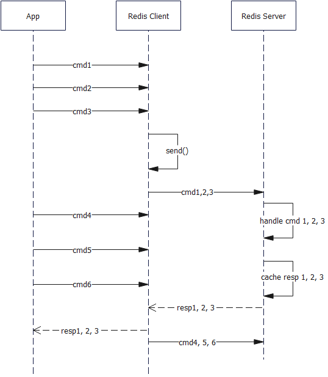

# Redis Pipeline
分析：Redis Pipeline 的面试主要停留在为什么 Pipeline 快这个核心要点，围绕着这个核心要点考察 Pipeline 的原理。同时还会结合考察如何在 Redis Cluster 里面使用 Pipeline，以及和批量命令的区别。

所以需要首先掌握 Pipeline 的大概原理。

Pipeline 的原理其实不难：

它的核心要点：
1. 应用代码会持续不断的把请求发给 Redis Client；
2. Redis Client 会缓存这些命令，等凑够了一批，就发送命令到 Redis 服务端；
3. Redis Server 收到命令之后进行处理，并且在处理完这一波命令之前，所有的响应都被缓存在内存里面；
4. Redis Server 处理完了 Pipeline 发过来的一批命令，而后返回响应给 Redis Client；
5. Redis Clinet 接收响应，并且将结果递交给应用代码；
6. 如果此时还有命令，Redis Client 会继续发送剩余命令

先来回顾一下普通的一个命令从发送出去到收到响应，要做些什么：
1. Redis Client 发起系统调用 send()，将命令发送给 Redis Server
2. 命令在网络中传输
3. Redis Server 发起系统调用 read()，从网络中读取命令
4. Redis Server 发起系统调用 send()，返回响应
5. 响应在网络中传输
6. Redis Client 发起系统调用 read()，读取响应

总结下来，整个过程就是四次系统调用，而后一个在网络中传输命令和响应——可以看做是一个 RTT。

那么假如有 N 个命令，这里就需要 N * 4 次系统调用，并且需要 N * RTT。

如果在 Pipeline 里面，如果恰好是 N 个命令发送一波，那么只需要四次系统调用加一个 RTT。但是这一个 RTT 和原本的单个 RTT 比起来是要慢一点的，因为这里要发送的数据量要多。

因此我们可以总结，使用 Pipeline 性能比较好就在于两点：
- 减少系统调用，避免内核态切换
- 减少了 RTT

而开销我们也能看出来：对于 Redis Client 来说，需要额外的内存缓存命令；对于 Redis Server 来说，需要额外的内存来缓存响应。

这两者的缓存，都跟 N 的大小有关。因此控制 N 的大小就比较关键了，N 同时影响着系统调用的数量和缓存所需的内存大小，两者需要权衡折中。此外，如果 N 很大，导致很难凑够 N 个命令，那么客户端的命令就会长期缓存，而没能够及时发送到服务端。

使用 Pipeline 的时候，服务端在收到命令之后会先缓存，因此 Redis Server 可能会把好几个不同客户端发过来的命令混在一起。

但是 Redis Server 保证了来自同一个 Pipeline 的命令会被顺序执行。只不过这并不意味着这 N 个命令是原子的。如果中间有任何一个命令失败，那么后续的命令将不会被执行，而已经被执行的命令，也不会回滚。

那么和批量处理命令比起来有什么不同？
- 从系统调用的角度来说，没什么不同
- 批量命令里面一批命令，必然是同种命令，比如说都是 Get，或者都是 Set；而 Pipeline 则不是，任何命令都可以通过 Pipeline 来发送

## 面试题
### Redis Pipeline 的原理
分析：这里基本上就是回答 Pipeline 的实现机制。在答基本步骤的过程中，可以有意识引导面试官问 N 的取值，N 对内存的影响。

最后简单总结一下 Pipeline 为什么快。

答案：Redis Pipeline 的原理是：
1. 应用代码会持续不断的把请求发给 Redis Client；
2. Redis Client 会缓存这些命令，等凑够了 N 个，就发送命令到 Redis 服务端。而 N 的取值对 Pipeline 的性能影响比较大（引导询问 N 的取值）；
3. Redis Server 收到命令之后进行处理，并且在处理完这 N 个命令之前，所有的响应都被缓存在内存里面。这里也可以看到，N 如果太大也会额外消耗 Redis Server 的内存（这里引导讨论内存消耗这个弊端）；
4. Redis Server 处理完了 Pipeline 发过来的一批命令，而后返回响应给 Redis Client；
5. Redis Clinet 接收响应，并且将结果递交给应用代码；
6. 如果此时还有命令，Redis Client 会继续发送剩余命令；

（刷亮点，也是引导）Redis Pipeline 减少了网络 IO，也减少了 RTT，所以性能比较好。

#### 类似问题
- 为什么 Redis Pipeline 在实时性上要差一点？主要就是命令和响应都会被缓存，而不是及时返回。

### Redis Pipeline 有什么优势？
分析：如果直接回答性能比较好，那么就基本等于没说。这个问题本质上其实是“为什么 Redis Pipeline 性能好”。

结合之前我们的分析，可以看到无非就是两个原因：网络 IO 和 RTT。

这里可以稍微讨论一下，批处理命令如 mget 和 mset 其实也是具备这两个优点的

答：Redis Pipeline 相比普通的单个命令模式，性能要好很多。

单个命令执行的时候，需要两次 read 和 两次 send 系统调用，加上一个 RTT。如果有 N 个命令就是分别乘以 N。

但是在 Pipeline 里面，一次发送，不管 N 多大，都是两次 read 和两次 send 系统调用，和一次 RTT。因而性能很好。

（刷亮点，准备引导面试官问和批处理命令的区别）实际上 mget 之类的批量命令，相比单个命令分别执行，也是只需要两次 read 和两次 send 系统调用，和一次 RTT。和 Pipeline 比起来没啥区别。

### Redis Pipeline 和 mget 的不同点

分析：虽然问的是不同点，但是一般回答都是相同点和不同点一起说。
相同点：
- 减少网络 IO 和 RTT，性能好
- Redis Cluster 对这两种用法都不太友好

不同点：
- Redis Pipeline 可以执行任意的命令，而 mget 之类的只能是执行同种命令；
- Redis Pipeline 的命令和响应都会被缓存，因此实时响应上不如 mget；
- Redis Pipeline 和 mget 都会受到批次大小的影响，但是相比之下 Redis Pipeline 更加严重，因为它消耗内存更多；

这里分析完之后，可以进一步分析两者的使用场景。其中 Redis Cluster 的问题属于引导，不必全部回答出来。

答：Redis Pipeline 和 mget 之类的批量命令有很多地方都很相似，比如说：

- 减少网络 IO 和 RTT，性能好（注意，这里可能面试官会问，它是如何减少 IO 和 RTT，也就是我们前面讨论优势的地方）
- Redis Cluster 对这两种用法都不太友好（这个是引导，准备讨论 Redis Cluster 需要的特殊处理）

但是具体来说，Redis Pipeline 使用场景和 mget 不太一样：
- Redis Pipeline 可以执行任意的命令，而 mget 之类的只能是执行同种命令；
- Redis Pipeline 的命令和响应都会被缓存，因此实时响应上不如 mget；
- Redis Pipeline 和 mget 都会受到批次大小的影响，但是相比之下 Redis Pipeline 更加严重，因为它需要缓存命令和响应，消耗更大；

（刷亮点，讨论什么时候用 Redis Pipeline）在频繁读写的情况下，使用 Redis Pipeline 都是能受益的。但是如果是追求实时响应的话，那么就不要使用 Redis Pipeline，因为 Redis Pipeline 的机制导致请求和响应会被缓存一小段时间。这种实时场景，只能考虑批量处理命令
#### 类似命令
- 什么时候选择 Redis Pipeline
- 什么时候选择 mget

### 如何在 Redis Cluster 上使用 Redis Pipeline

分析：首先，一般的说法都是 Redis Cluster 上无法使用批量命令和 Pipeline。这种说法其实没什么大问题，但是实际上我们可以考虑在客户端上做一些改造，使得在 Redis Cluster 上也能使用 Pipeline。

核心要点：
- 知道 Redis Cluster 上槽的分布。假如说 Redis Cluster 有 ABC 三个节点，并且 0-5000 槽在 A 上，5001-10000 槽在 B 上，10001-16384 在 C 上；
- 我们在每个节点上都创建一个 Pipeline
- 当请求过来，比如说找 key1, key2, key3
- 这时候，根据 key1, key2, key3 知道对应的槽，假说 key1 槽是 100，key2 槽是2000，key3 槽是6000
- 根据槽找到对应的节点。key1 和 key2 对应 A，key3 对应 B
- 找到在该节点上创建的 Pipeline，发送命令。key1 和 key2 通过 A 上的 Pipeline 发送，key3 上的通过 B 的 Pipeline 来发送

所以本质上这个过程，就是手动将 key 按照槽分布到不同节点，然后使用不同节点上的 Pipeline。

答：一般来说，Redis Pipeline 是针对节点，所以会说无法在 Redis Cluster 上使用 Pipeline。这种说法是指，我们无法创建一个 Pipeline，连上整个 Redis Cluster。

但是实际上，我们可以通过创建多个 Pipeline 分别连上每一个节点来在 Redis Cluster 上使用 Pipeline。

这种使用方式的核心在于：当我们收到一个请求时，要能计算出来它的槽。而后根据槽找到对应的节点。然后将请求发送到该节点对应的 Pipeline 上。

#### 类似问题
- Redis Cluster 上能不能使用 Pipeline？